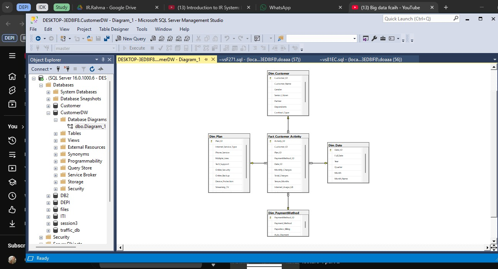

# End-to-End Customer Churn Prediction Pipeline

## 📜 Overview
This project is an end-to-end solution for analyzing and predicting customer churn for a Telco company. It goes beyond a simple ML model by building a complete **Data Warehouse (DWH)** using **MS SQL Server**. This DWH serves as the "Single Source of Truth" by ingesting, processing, and modeling raw data, which is then used to train a predictive model and power an interactive web application.

## 🗄️ Tech Stack
* **Database & DWH:** MS SQL Server
* **Data Pipeline (ETL):** T-SQL
* **Data Analysis & Modeling:** Python (Pandas, Scikit-learn, Pyodbc)
* **Interactive Application:** Streamlit

## 🎯 Target Audience & Stakeholders
This project is designed to deliver value across different levels of the organization:

* **Strategic Level (C-Suite, Product Team):**
    * **Interest:** High-level KPIs (Overall Churn Rate, Revenue Impact) and the *root causes* of churn.
    * **Use Case:** Use the **Streamlit Dashboard** for KPI monitoring and the **ML Model's insights** (e.g., feature importance) to understand why customers leave and make strategic product or pricing decisions.

* **Operational Level (Marketing & Retention Teams):**
    * **Interest:** Identifying *which* customers are at high risk of churning, *before* they leave.
    * **Use Case:** Use the **Streamlit App's** live prediction and high-risk customer lists to proactively target at-risk segments with retention campaigns and special offers.

* **Technical Level (Data Science & Data Engineering Teams):**
    * **Interest:** A clean, reliable, and centralized data source.
    * **Use Case:** Use the **Data Warehouse (Phase 1)** as the "Single Source of Truth" for all future analyses and models. The **T-SQL pipeline (ETL)** will be maintained to ensure data freshness and reliability.

---

## 🏛️ Phase 1: Data Engineering
The goal of this phase was to build a robust and reliable DWH following a multi-layered architecture to ensure data quality, governance, and maintainability.

### 1. DWH Schema
The warehouse is built on a Star Schema, which is optimized for analytical queries. It consists of one central Fact table and four Dimension tables.



### 2. ETL Layers (T-SQL Pipeline)
The entire Extract, Transform, and Load (ETL) process is orchestrated using T-SQL scripts, moving data through three distinct logical layers within SQL Server:

* **Layer 1: Staging Layer**
    * **Purpose:** Ingests raw data from `.csv` files as-is.
    * **Implementation:** Uses `BULK INSERT` for high-speed data loading into `Staging` tables.
    * *(Reference: `Layer 1.sql` / `DEPI.sql`)*

* **Layer 2: Cleansed Layer**
    * **Purpose:** Transforms data from Staging into a clean, standardized, and usable format.
    * **Implementation:** Involves data type correction (e.g., `CAST`), handling missing values (e.g., `ISNULL`), and standardizing values (e.g., `CASE WHEN 'yes' THEN 1 ELSE 0 END`).
    * *(Reference: `Layer 2.sql`)*

* **Layer 3: DWH (Presentation) Layer**
    * **Purpose:** Loads the clean data into the final Star Schema.
    * **Implementation:** Populates the `Dim_` and `Fact_` tables from the `Cleansed` layer. Enforces Primary Keys (PK) and Foreign Keys (FK) to ensure referential integrity.
    * *(Reference: `Layer 3.sql`)*

---

## 🧠 Phase 2: Machine Learning Model
In this phase, we connect to the DWH built in Phase 1 as our reliable source for training the predictive model.

* **1. Data Retrieval & EDA:**
    * Connects to the `CustomerChurn` DWH (DWH Layer) directly from Python using `pyodbc`.
    * Executes a `SELECT` query with `JOINs` to merge `Fact_Customer_Activity` with all its dimensions, creating a single, denormalized view for modeling.
    * Performs initial Exploratory Data Analysis (EDA).
    * *(Reference: `First_Milestone .ipynb`)*

* **2. Preprocessing & Model Training:**
    * Applies feature engineering and preprocessing steps (e.g., One-Hot Encoding, StandardScaler) to the data.
    * Splits the data into training and testing sets.
    * Trains and evaluates several classification algorithms (e.g., Logistic Regression, Random Forest, XGBoost) to select the best-performing model based on `Accuracy` and `F1-Score`.
    * *(Reference: `Customer_Churn_Model.ipynb`)*

---

## 📊 Phase 3: Streamlit Application (In-Progress)
This is the final user-facing interface, an interactive dashboard designed for two main purposes:

* **1. Business Intelligence (BI):** Displaying interactive visualizations for key KPIs related to churn, such as:
    * Overall Churn Rate
    * Churn by Contract Type
    * Churn by Payment Method

* **2. Live Prediction:**
    * A simple form where a user can input new (hypothetical) customer data.
    * The app passes this data to the saved model and returns a live prediction (e.g., "This customer has an 80% probability of churning.").

---

## 🚀 How to Run This Project
To replicate this project locally:

1.  **Set up the Database:**
    * **Option A (Fastest):** Restore the database on your MS SQL Server instance using the `CustomerChurn.bak` file.
    * **Option B (Manual):**
        1.  Create a new database (e.g., `CustomerChurn`).
        2.  **Crucial:** Open `Layer 1.sql` (or `DEPI.sql`) and update the `BULK INSERT` file paths to match the absolute paths of the `.csv` files on your local machine.
        3.  Execute the SQL scripts in order: `Layer 1.sql` > `Layer 2.sql` > `Layer 3.sql`.

2.  **Run the Notebooks:**
    * Ensure you update the database connection string (server name, credentials) in `First_Milestone .ipynb` and `Customer_Churn_Model.ipynb`.
    * Run the cells to perform the analysis and model training.

3.  **Launch the App (Once complete):**
    ```bash
    streamlit run app.py
    ```
